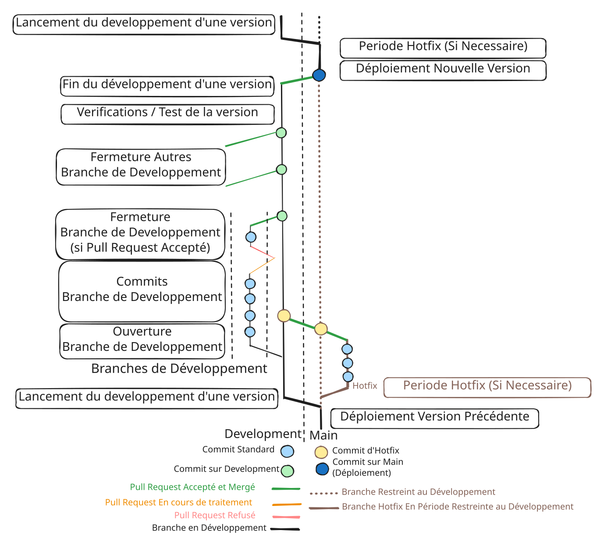

# 💾 Contribution sur Git

Le développement de SMBW Randomizer est communautaire mais pour maintenir un ordre dans le repo github j'ai crée une procedure a suivre (résumé avec le schema suivant)

SMBW Randomizer en plus des branches relatif au développement possède un lot de branches relative a la documentation

## Les Branches de documentation "gitbook"

La branche Gitbook est la branche qui contient la documentation du projet, toute les branches initié a partir de cette derniere sont relatif a gitbook et sont controlé par l'intégration gitbook github sync

## Les branches de Développements

Voici les Branches relatives au développement, ils y'en a 4 types

### La branche "Main"

Cette Branche contient les versions public de SMBW\_Randomizer \
(versions déployé et hotfix de version déployé)\
\
elle est mis a jour lors\
\- Du Déploiement d'une nouvelle version (a partir de la branche "development")

### La branche "Development"

Cette branche contient un aperçu de la futur version de SMBW\_Randomizer, elle permet aux utilisateurs experimenté de tester les nouvelles fonctionnalités avant leurs sortie publique.\
\
elle est mise a jour \
\- au lancement du développement d'une version (a partir de la branche "main")\
\- lors qu'un hotfix est déployé pendant une periode de développement (a partir de la branche "main")\
\- a l'incorporation d'une Branche de Développement (si la Pull Request est accepté)

### Les branches Hotfix

Les branches Hotfix sont géré par l'auteur du repo principal et les développeurs considéré comme de confiance par ce dernier

### Les Branches de Développement

Une branche de développement est crée lorsqu'une personne souhaite contribuer au projet et elle ont une convention de nommage adapté en fonction de la contribution\
\
\- Développement / mise a jour d'un module de randomisation : \
module-\<nom\_du\_module>-\<version>-\<nom\_d'utilisateur\_git>\
\
\- Correction d'un Bug sur un module de randomisation : \
bugfix-\<nom\_du\_module>-\<identifiant issue>-\<nom\_d'utilisateur\_git>\
\
\- Amélioration du profil sécurisé d'un module : \
security-\<nom\_du\_module>-\<identifiant\_issue>-\<nom\_d'utilisateur\_git>


L'utilisation de votre Nom d'utilisateur git permet a plusieurs développeur de contribuer a leurs manière sur un même élément et permet aux développeurs d'etre crédité (que leurs travail soit mergé ou non)



Pour la correction d'un module de randomisation ou l'Amélioration d'un profil sécurisé vous devez créer une issue au préalable (pour décrire le problème trouvé)\
(Cela n'est pas nécessaire si l'issue existe deja)\
Ensuite écrivez un commentaire pour signaler que vous travaillez sur cette issue et fournissez le lien git vers la branche sur votre fork\
\
Je vous conseille de verifier si une issue existe avant toute procédure et si un contributeur travaille dessus\
\
Si vous avez trouvé un correctif, créez une branche en respectant la convention de nommage et proposez une pull request



Si l'utilisateur n'existe pas sur la plateforme git ou est stocké le repo (actuellement Github) ou que l'utilisateur git n'a pas "forké" le projet toute Pull Request sera rejeté d'office\
\
Si la convention de nommage n'est pas respecté ou que les données suivantes sont incorrect \<nom\_du\_module> \<identifiant\_issue> \<version> la branche sera supprimé sur le repo original\
\
Vous pourrez cependant la réuploader en corrigeant les données concernés

