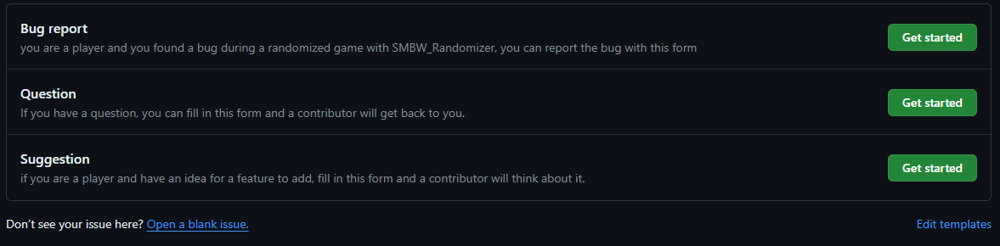

# 📨 Déclaration / Suivi d'Issue

Vous avez découvert un bug, vous avez une suggestion ou une question le systeme d'issue contient des formulaires vous permettant de contacter les contributeur du projets

Pour cela il suffit d'aller dans la catégorie issue et cliquer sur new issue pour afficher la liste des formulaires\

<figure><figcaption>
Catégorie issue du github de SMBW_Randomizer
</figcaption></figure>

<figure><figcaption>
Liste des formulaire actuel
</figcaption></figure>

Chaque formulaire contient differente question auquel vous devrez répondre, veuillez bien répondre aux question pour permettre au contributeur d'y répondre plus facilement
